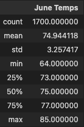
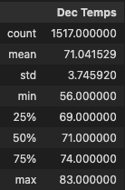

# Surfs_up Analysis

## Overview of the analysis
W. Avy  wants more information about temperature trends before opening the surf shop. Specifically, he wants temperature data for the months of June and December in Oahu, in order to determine if the surf and ice cream shop business is sustainable year-round.

## Results:

* Temperatures in June Ranges from 64F to 85 F with 50% of the data between 73 F and 77 F and a mean of 75F

* Temperatures in Dec Ranges from 56F to 83 F with 50% of the data between 69 F and 74 F and a mean of 71F

## Summary:
Based on the data above looks like the weather is not too different from Jun to Dec, and temperature ranges are very well suited for surfing. 
It will be great to query precipitation for Jun and Dec  to have better data and confirm that indeed the weather is not going to be an issue for the ice cream shop

